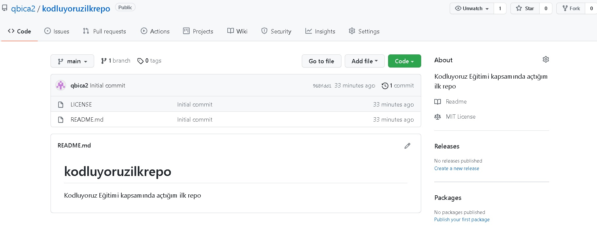

# Kodluyoruz İlk Repo
 Bu repo [kodluyoruz](https://kodluyoruz.org) Front-End Eğitiminde oluşturduğumuz ilk repo. İçerisinde bir adet README dosyası, bir adet de index.html barındırıyor.

## Installation

 Öncelikle projeyi clonelayın. (Buraya sizin reponuzdan aldığınız link gelecek)

> git clone https://github.com/qbica2/kodluyoruzilkrepo.git 

## Usage

 Projeyi cloneladıktan sonra Visual Studio Code programında açınız.

 Linux için:

> cd kodluyoruzilkrepo    
> code . 

## Contributing

 Pull requestler kabul edilir. Büyük değişiklikler için, lütfen önce neyi değiştirmek istediğinizi tartışmak için bir konu açınız.

## License

[MIT](https://choosealicense.com/licenses/mit/)

